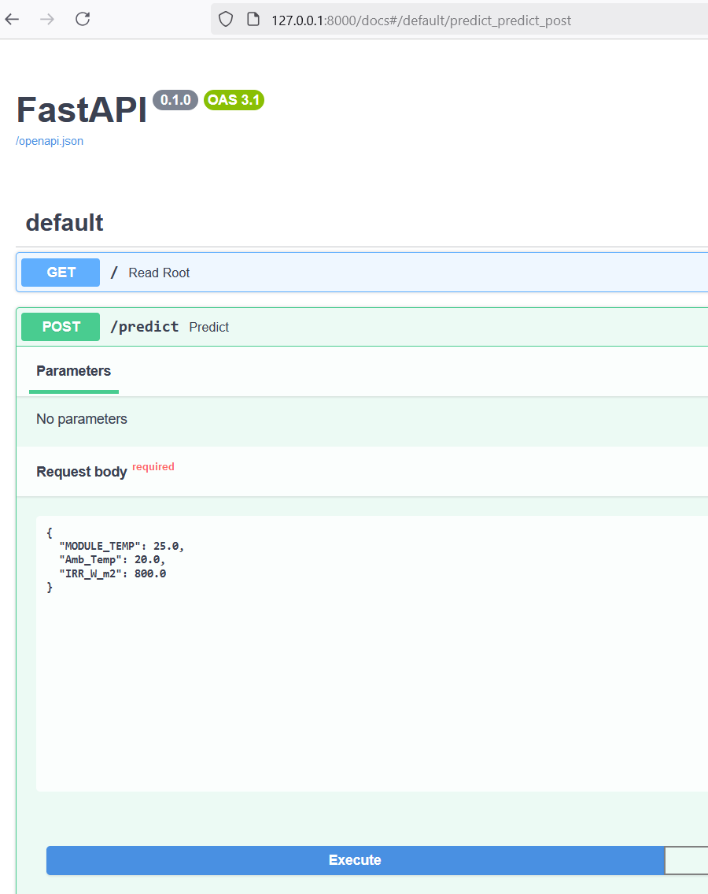
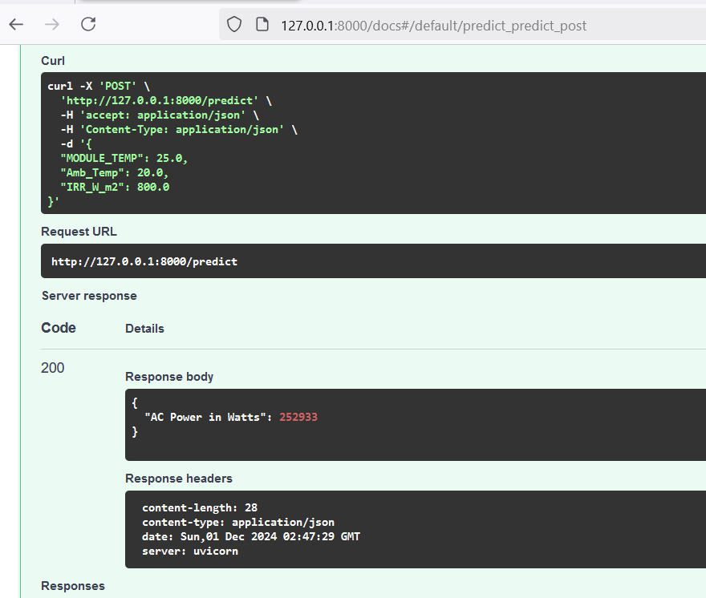
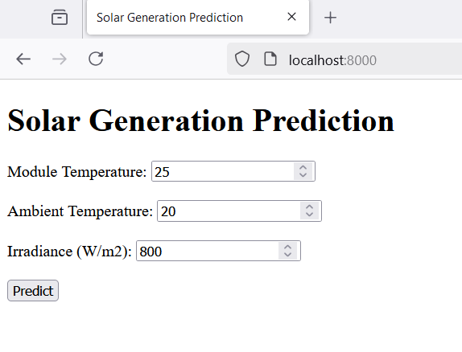
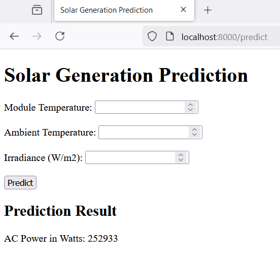

# ProyectoFinal-IA-SolarGeneration-TdeA

## Integrantes

- Sarish Pineda
- Eldigardo Camacho

## Descripción del Proyecto

Este proyecto tiene como objetivo predecir la generación de energía solar utilizando un modelo de Machine Learning. Se ha utilizado el modelo LightGBM para realizar las predicciones basadas en datos de temperatura del módulo, temperatura ambiente e irradiancia.

## Notebooks

### 1. 1_SolarGeneration_Exploracion.ipynb

En este notebook se realiza la limpieza y preprocesamiento de los datos. Se manejan valores nulos, se normalizan las variables y se realiza un análisis exploratorio de los datos.

### 2. 2_SolarGeneration_Modelacion.ipynb

En este notebook se entrenan varios modelos de regresión, incluyendo LightGBM, para predecir la generación de energía solar. Se divide el conjunto de datos en entrenamiento y prueba, se ajustan los hiperparámetros y se evalúa el rendimiento de los modelos.

### 3. 3_SolarGeneration_Pipeline.ipynb

En este notebook se crea el pipeline necesario para guardar el modelo y utilizarlo posteriormente con la API. Se evalúa el modelo entrenado utilizando métricas como el RMSE y el MAE, y se realiza una validación cruzada para asegurar la robustez del modelo.

## Conclusiones

Después de entrenar y evaluar varios modelos, se concluyó que el modelo de LightGBM proporciona predicciones precisas de la generación de energía solar. Las métricas de evaluación indican que el modelo es robusto y generaliza bien en datos no vistos.

## API

Se ha desarrollado una API utilizando FastAPI para permitir la predicción de la generación de energía solar en tiempo real.

### Ejecución de la API en Local

Para ejecutar la API en local, sigue los siguientes pasos:

1. Clona el repositorio:

   ```bash
   git clone https://github.com/tu_usuario/ProyectoFinal-IA-SolarGeneration-TdeA.git
   cd ProyectoFinal-IA-SolarGeneration-TdeA
   ```
2. Instala las dependencias:

   ```bash
   pip install -r requirements.txt
   ```
3. Ejecuta la API:

   ```bash
   uvicorn main:app --reload
   ```
4. Abre tu navegador y ve a `http://127.0.0.1:8000/docs` para acceder a la interfaz de Swagger y probar el endpoint `/predict`.

### Ejemplo de Predicción

Puedes ensayar la API con la siguiente data para el endpoint `/predict`:

```json
{
  "MODULE_TEMP": 25.0,
  "Amb_Temp": 20.0,
  "IRR_W_m2": 800.0
}
```

### Ejemplo de Solicitud y Respuesta

A continuación se muestra un ejemplo de una solicitud y respuesta utilizando la API:

#### Solicitud



#### Respuesta



### Ejemplo de Solicitud y Respuesta con Template Web

A continuación se muestra un ejemplo de una solicitud y respuesta utilizando el template web:

#### Solicitud



#### Respuesta


